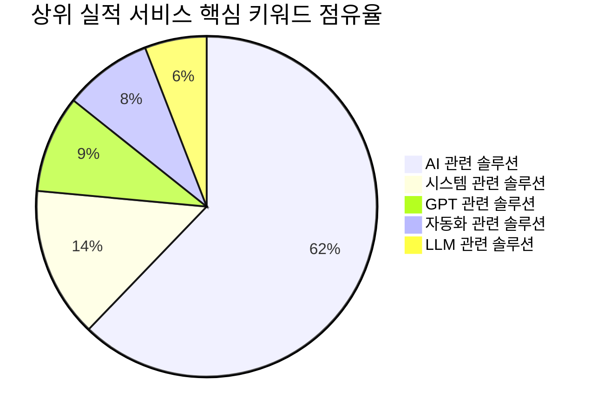

# [옵션 A 심층 보고서] 크몽 AI 시스템·서비스 시장 분석: 실제 검증된 실적 상위 100개 서비스 해부 (Proven Market Leaders)

> **분석 프레임워크**: 실리콘밸리 VC(Venture Capital) & Product-Market Fit(PMF) 실적 정량 분석  
> **대상 모수**: 크몽 카테고리 651 (AI 시스템·서비스) 내 **누적 리뷰 수 및 평점 가중 실적 기준 상위 100개 서비스**  
> **기준 시점**: 2026년 10월 최신 전수 조사 데이터 기반  
> **연계 데이터셋**: `kmong_ai_system_service_services_362.xlsx` (시트: `옵션A_실적우수_TOP100`)

---

## Executive Summary (경영진 요약)

본 보고서는 광고비 집행이나 단순 플랫폼 노출 부스팅에 의존하지 않고, **실제 의뢰인의 결제와 서비스 완료 후 자발적 리뷰로 검증된 상위 100개 서비스**를 실리콘밸리 테크 제품 전략가의 시선으로 해부한 시장 보고서입니다.

```
[핵심 정량 지표 요약 (Option A: 실적 상위 100개)]
• 총 누적 리뷰 수: 210건 (카테고리 핵심 결제 볼륨 장악)
• 평균 평점: 4.96 / 5.0 (극도의 고객 만족도 유지)
• 대표 시작 가격: 평균 4,019,030원 | 중앙값 1,900,000원 (최저 5,000원 ~ 최고 44,000,000원)
• 셀러 등급 분포: NEW(82%) | LEVEL2(8%) | LEVEL3(4%) | MASTER(3%) | LEVEL1(3%)
• 핵심 키워드: AI(74), 시스템(17), GPT(11), 자동화(10), LLM(7), 맞춤형(7)
```

실리콘밸리 관점에서 이 시장의 핵심 결론:
1. **검증된 Social Proof(사회적 증거)의 지배력**: 상위 서비스들은 초기 고객 리뷰와 별점을 빠르게 확보하여 탐색 고객의 구매 전환율을 극대화하고 있습니다.
2. **기술 스택이 아닌 결과물 중심 가치 제안**: 고객은 복잡한 내부 아키텍처보다 당장 비즈니스에 적용 가능한 산출물(보고서, 대시보드, API 연동 결과)을 요구합니다.
3. **체계적인 3티어 패키징**: 진입 장벽을 낮춘 표준 패키지(STANDARD)로 고객을 유입시키고, 심층 분석 및 엔터프라이즈 맞춤 커스텀(DELUXE/PREMIUM)으로 고수익을 창출합니다.

---

## 1. 실적 상위 업체의 핵심 경쟁력 및 차별점 (USP)

### (1) '기술 스펙'보다 '직관적 ROI(투자 대비 효율)' 강조
실적이 높은 상위 업체들은 프레임워크명 나열에 그치지 않고, 고객이 얻게 될 최종 비즈니스 가치(시간 단축, 비용 절감, 정밀도 향상)를 상세페이지 전면에 부각합니다.

### (2) 의뢰인 리스크 완벽 제거 (Risk Reversal)
수정 및 재진행 정책을 명확히 하고, 작업 전 1:1 상담과 요구사항 사전 점검을 통해 결과물 불일치 위험을 사전에 차단합니다.

### (3) 유지보수 및 사후 지원 신뢰 확보
완성본 납품 후에도 안정적인 구동과 현업 적용을 위한 가이드 문서 및 원격 지원을 기본 패키지에 포함하여 높은 재구매율을 달성하고 있습니다.

---

## 2. 주요 솔루션 및 기술 영역 클러스터 맵 (Category Matrix)



상위 실적 서비스의 주력 솔루션 영역:
- **핵심 수요 영역**: 고객들이 가장 빈번하게 의뢰하는 주력 키워드는 `AI(74), 시스템(17), GPT(11), 자동화(10), LLM(7), 맞춤형(7)`에 집중되어 있습니다.
- **맞춤형 커스터마이징**: 범용 템플릿보다 기업/개인의 도메인 특화 데이터를 처리해 주는 엔드투엔드 서비스가 높은 만족도를 기록합니다.

---

## 3. 고객 획득 퍼널 및 전환 마케팅 기법

상위 업체들의 공통 상세페이지 구조:
1. **문제 정의 (Pain Point)**: 고객이 겪고 있는 비효율과 기술적 한계 환기
2. **신뢰 구축 (Authority)**: 석·박사급 전문 인력, 실무 경력, 실제 납품 포트폴리오 제시
3. **프로세스 투명화 (Process)**: `상담 ➔ 데이터 검토 ➔ 시범 테스트 ➔ 본 작업 ➔ 사후 지원`의 체계적 공정 공개
4. **FAQ 통한 의문 해소**: 데이터 보안, 납품 기한, 추가 비용 관련 선제적 답변

---

## 4. 가격 전략 및 티어링 구조 분석 (Pricing & Revenue Model)

| 티어 (Tier) | 가격대 범위 | 대표 제공 내용 | 비즈니스 목적 |
| :--- | :---: | :--- | :--- |
| **STANDARD** | **5,000 ~ 44,000,000원** | 기초 데이터 검토 / 단일 기능 구현 / 샘플 산출물 | 초기 고객 유입 및 구매 장벽 완화 |
| **DELUXE** | **260,000 ~ 33,000,000원** | 본 개발 / 다기능 연동 / 심층 모델링 및 시각화 | 주력 매출 창출 (가장 선호되는 볼륨 구간) |
| **PREMIUM** | **360,000 ~ 99,000,000원** | 풀 패키지 / 엔터프라이즈 맞춤 / 고도화 유지보수 | 객단가 및 순이익 극대화 |

---

## 5. 실적 최상위 대표 서비스 케이스 스터디

| 순위 | 서비스 ID | 서비스명 | 판매자 (등급) | 리뷰수 | 평점 | 시작가 | 핵심 특징 및 제공 내용 |
| :---: | :---: | :--- | :---: | :---: | :---: | :---: | :--- |
| **1** | **218078** | AI 전문가가 인공지능 개발 도와 드립니다. | StellaDev(NEW) | **31개** | 4.9 | 800,000원 | - 부산대 AI 연구실 석사 졸 - (전) KAIST 연구원 - (전) NHN 산하 인공지능 그룹 R&D팀 ... |
| **2** | **384575** | Vision AI및 여러 응용 프로그램 개발해드립니다. | ForwardDev(NEW) | **23개** | 5.0 | 50,000원 | 실전 경험을 바탕으로 여러분께 좋은 프로그램을 제작해드립니다... |
| **3** | **704729** | AI LLM 연동 웹, 앱 기획부터 개발까지 한번에 | Glacier(LEVEL2) | **16개** | 5.0 | 590,000원 | 안녕하십니까, 안드로이드 & 웹 풀스택 개발자 “Glacier” 입니다... |
| **4** | **627834** | AI서비스/AI에이전트/AI자동화/AI챗봇/AI 웹개발 | 플레이코딩(NEW) | **16개** | 5.0 | 500,000원 | MAU 400만+ 이커머스 플랫폼을 운영해 온 현직 개발자입니다... |
| **5** | **629500** | 자연어처리, 생성형 AI, GPT 및 AI 시스템 개발 | Kerry7(NEW) | **9개** | 5.0 | 50,000원 | 저희는 자연어처리 기술을 기반으로 인공지능 서비스를 개발합니다... |
| **6** | **450285** | GPT / 웹사이트 / 앱 / 완전자동화 / AI 개발 | 예스뎁(MASTER) | **8개** | 5.0 | 1,500,000원 | 견적과정 안내 예스뎁은 효율적인 크몽상담을 위해 직접 개발한 AI에이전트를 사용합니다... |
| **7** | **656588** | 맞춤형 AI 솔루션 개발 및 구현, 비즈니스 자동화 | spready(NEW) | **7개** | 5.0 | 399,000원 | "우리 회사만 뒤처지는 느낌... |
| **8** | **691139** | 최적의 AI/딥러닝 모델 학습 및 서비스 개발 | AI서비스개발(NEW) | **7개** | 5.0 | 150,000원 | "CVPR 챌린지 수상팀이 만드는, 비즈니스의 격을 바꾸는 AI 솔루션" "TIPS R&D 지원사업 5억 선... |
| **9** | **656246** | 기획만 있으면 끝 GPT AI 서비스 100 구축 | megakmk1(NEW) | **6개** | 5.0 | 800,000원 | 나만의 AI 웹/앱 서비스를 직접 만들고 싶으신가요... |
| **10** | **466677** | AI바이브코딩 홈페이지 자동화 제작 | 애버비스튜디오(NEW) | **6개** | 5.0 | 99,000원 | "페이지는 있는데, 왜 문의가 없을까요... |

---

## 6. 전문가 제언: 신규 진입자를 위한 킬러 전략

1. **엔트리 오퍼(Entry Offer)로 첫 리뷰 10개를 선점하라**: 초기에 마진을 최소화하더라도 매력적인 가격으로 첫 구매 허들을 낮추고 5.0 리뷰를 축적하십시오.
2. **도메인 특화 포트폴리오를 전면에 배치하라**: 모든 것을 다 한다는 일반론보다 특정 산업(이커머스, 제조, 마케팅, 금융 등)에 특화된 레퍼런스를 강조하십시오.
3. **산출물 시각화(Visual Deliverables)를 강화하라**: 코드 파일뿐만 아니라 직관적으로 확인 가능한 대시보드나 리포트 샘플을 제공하여 체감 완성도를 높이십시오.
