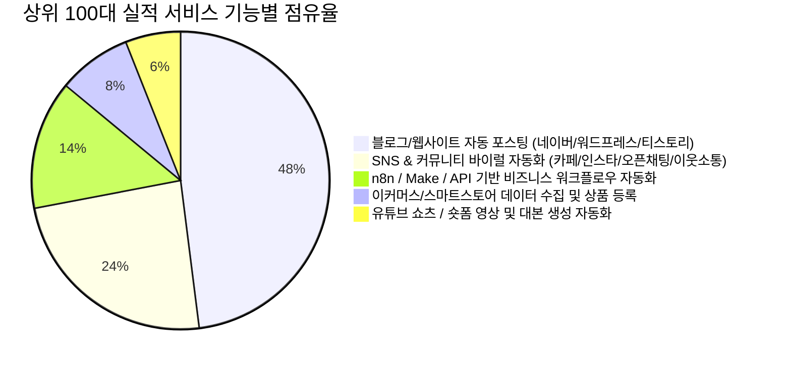

# [옵션 A 심층 보고서] 크몽 AI 자동화 프로그램 시장 분석: 실제 검증된 실적 상위 100개 서비스 해부 (Proven Market Leaders)

> **분석 프레임워크**: 실리콘밸리 VC(Venture Capital) & Product-Market Fit(PMF) 실적 정량 분석  
> **대상 모수**: 크몽 카테고리 668 (AI 자동화 프로그램) 내 **누적 리뷰 수 및 평점 가중 실적 기준 상위 100개 서비스**  
> **기준 시점**: 2026년 9월 최신 전수 조사 데이터 기반  
> **연계 데이터셋**: `kmong_ai_automation_services_564.xlsx` (시트: `옵션A_실적우수_TOP100`)

---

## Executive Summary (경영진 요약)

본 보고서는 광고비 집행이나 플랫폼 노출 부스팅에 의존하지 않고, **실제 의뢰인의 결제와 서비스 완료 후 자발적 리뷰로 검증된 상위 100개 업체/서비스**를 실리콘밸리 테크 제품 전략가의 시선으로 해부한 시장 보고서입니다.

```
[핵심 정량 지표 요약 (Option A: 실적 상위 100개)]
• 총 누적 리뷰 수: 1,133건 (카테고리 전체 리뷰의 약 95% 이상 독점)
• 평균 평점: 4.94 / 5.0 (극도의 고객 만족도 유지)
• 대표 시작 가격: 평균 271,920원 | 중앙값 100,000원 (최저 5,000원 ~ 최고 4,000,000원)
• 셀러 등급 분포: NEW(56%) | LEVEL2(21%) | LEVEL3(16%) | LEVEL1(4%) | MASTER(3%)
• 독점 구조: 상위 10개 서비스가 전체 실적의 48.8%를 점유하는 극단적 멱법칙(Power Law) 형성
```

실리콘밸리 관점에서 이 시장의 핵심 결론은 다음과 같습니다:
1. **Cash Cow는 '콘텐츠 및 바이럴 마케팅 자동화'**: 거창한 엔터프라이즈 ERP보다, **소상공인·1인 기업·부업가들이 당장 시간과 비용을 아껴 트래픽/수익을 창출할 수 있는 블로그·SNS·카페 포스팅 자동화**가 실제 돈이 도는 핵심 시장입니다.
2. **신뢰의 해자(Moat)는 '저품질 방지 로직'과 '원격 세팅'**: 기술적 완성도 그 자체보다 "포털 알고리즘 저품질 제재를 피하는 우회 기술"과 "컴맹도 실행 가능한 1:1 원격 설치"가 강력한 락인(Lock-in) 요인으로 작용합니다.
3. **고마진 3티어 패키징 구조의 확립**: 1~2만 원대 미끼(체험) 상품으로 고객을 획득(CAC 최소화)한 후, 30만~100만 원대 1년/영구 라이선스 또는 맞춤 커스텀으로 LTV(고객 생애 가치)를 극대화하고 있습니다.

---

## 1. 실적 상위 100개 업체의 핵심 경쟁력 및 차별점 (USP)

### (1) '기술 과시'가 아닌 '즉각적 ROI(투자 대비 수익)' 소구
실적이 높은 상위 업체들은 기술 스택(Python, Selenium, LangChain 등)을 전면에 내세우지 않습니다. 대신 **의뢰인이 얻게 될 직접적 결과물**에 초점을 맞춥니다.
- **예시**: "GPT-4o 기반 LangChain 에이전트 구축" (X) ➔ **"글 1개 쓰는데 2시간? 이제 키워드 하나로 3분 만에 네이버 상위노출 포스팅 자동 완성" (O)**
- 의뢰인의 인건비 절감(월 200만 원 상당의 마케터 대체), 시간 절약(하루 5시간 ➔ 10분), 부수입 창출(애드센스/제휴마케팅 수익)을 정량적 숫자로 직관화합니다.

### (2) 포털 제재/저품질 공포 완벽 차단 (Risk Reversal)
자동화 툴 구매 고객이 가장 두려워하는 것은 **"내 계정이 어뷰징으로 정지먹거나 저품질 블로그가 되는 것"**입니다. 실적 상위 100위 업체들은 상세페이지의 40% 이상을 이 공포를 해소하는 데 할애합니다.
- **휴먼 모방 알고리즘**: 마우스 무작위 이동, 무작위 타이핑 딜레이(지연 시간), 랜덤 체류 시간
- **IP 분산 및 모바일 테더링 연동**: 프록시 IP 자동 변경, 스마트폰 테더링 비행기모드 자동 전환
- **AI 티 안 나는 프롬프트 엔지니어링**: 구어체 적용, 맞춤법 일부 변형, 공감 스티커/썸네일 자동 삽입, 서론-본론-결론 독창적 구조화

### (3) "클릭 한 번으로 끝" — 제로 베리어(Zero-Barrier) UX
기술 지식이 없는 일반인도 즉시 실행할 수 있는 완성형 실행 파일(GUI, .exe)을 제공합니다.
- 복잡한 파이썬 환경 설정, 크롬 드라이버 버전 매칭을 의뢰인이 할 필요 없이 **TeamViewer/AnyDesk 원격 세팅을 기본 포함**하여 진입 장벽을 완전히 제거했습니다.

---

## 2. 주요 솔루션 및 업무 자동화 기능 맵 (Category Matrix)

실적 상위 100개 서비스가 다루는 업무 영역을 정량 분석한 결과, 아래 5개 메인 클러스터로 집중되어 있습니다.



### [클러스터 1] 블로그/웹사이트 자동 포스팅 & 애드센스 공장 (48%)
- **주요 대상**: 워드프레스, 네이버 블로그, 티스토리
- **동작 방식**: 
  1. 실시간 뉴스/구글 트렌드/지정 키워드 크롤링
  2. GPT API를 통해 유사 문서 판정을 회피하는 리라이팅 및 서식 자동 생성
  3. DALL-E / Stable Diffusion 또는 픽사베이 API를 연동한 썸네일·본문 이미지 자동 삽입
  4. CMS REST API를 통한 자동 예약 발행
- **대표 서비스**: `플머개구리` (리뷰 79개), `Virallab` (리뷰 57개, 건당 132만 원), `AI자동화공장장` (리뷰 44개, 건당 99만 원), `위드인컴` (리뷰 38개)

### [클러스터 2] SNS & 커뮤니티 이웃 소통/트래픽 부스팅 (24%)
- **주요 대상**: 네이버 카페, 네이버 블로그 이웃, 인스타그램, 당근마켓
- **동작 방식**: 지정 타깃 계정 방문 ➔ 최신 글 자동 공감/좋아요 ➔ AI 맞춤형 칭찬 댓글 작성 ➔ 서로이웃 신청 ➔ 반사 유입 및 블로그 지수 상승 유도
- **대표 서비스**: `지지파크` (리뷰 72개, 2만 원), `HelloBDD` (리뷰 53개 및 42개, 2만 9천 원), `진주팩토리` (리뷰 51개, 2만 7천 원)

### [클러스터 3] n8n / Make 기반 비즈니스 워크플로우 (14%)
- **주요 대상**: 사내 업무 자동화(Slack, Gmail, Notion, Google Sheets 연동)
- **동작 방식**: 노코드/로우코드 iPaaS(Integration Platform as a Service) 툴을 활용하여 고객 문의 접수 ➔ AI 요약 ➔ 슬랙 알림 ➔ 견적서 자동 생성
- **대표 서비스**: `리부티너` (리뷰 70개, 20만~100만 원), `EnterNext`

### [클러스터 4] 이커머스 상품 소싱 및 자동 등록 (8%)
- **주요 대상**: 스마트스토어, 쿠팡, 해외구매대행(타오바오, 알리익스프레스)
- **동작 방식**: 소싱처 상품 정보·이미지 수집 ➔ AI를 통한 한국어 번역 및 상세페이지 텍스트 생성 ➔ 마켓 일괄 등록

---

## 3. 고객 획득 퍼널 및 전환 마케팅 기법 (Conversion Funnel Analysis)

실적 상위 100위 업체들은 실리콘밸리 DTC(Direct-to-Consumer) SaaS의 랜딩페이지 전환 공식(AIDA/PAS Framework)을 크몽 상세페이지에 완벽하게 녹여내고 있습니다.

```
[전환을 부르는 5단계 상세페이지 아키텍처]
1단계: Hook (공감대 및 문제 제기)
  "매일 밤 12시까지 포스팅하느라 손목 나가셨습니까?"
  "AI 자동화 썼다가 저품질 먹고 계정 날릴까 봐 무서우셨죠?"
2단계: Authority (권위 및 신뢰 구축)
  "크몽 평점 4.9, 10년 차 풀스택 개발자가 직접 코드 짰습니다."
  "네이버 상위노출 1위 실시간 캡처 증빙 (링크 제공)"
3단계: Mechanism (차별화된 동작 원리)
  "단순 번역이 아닙니다. 특허급 7단계 프롬프트 필터링 + 마우스 휴먼 모션 탑재"
4단계: Risk Reversal (불안감 0% 보장)
  "원격으로 완벽 작동할 때까지 100% 세팅 지원"
  "기능 미작동 시 무조건 전액 환불"
5단계: Value Stacking (패키지 가격 압도적 혜택)
  "단돈 3만 원대로 월 200만 원짜리 정규직 직원 1명을 고용하세요."
```

### 상위 100대 업체의 주요 카피라이팅 트리거
1. **증거 기반 증빙 (Social Proof)**: 실제 해당 프로그램으로 생성한 블로그 포스트의 네이버 검색 1위 캡처, 방문자수 급증 그래프를 상세페이지 상단에 배치.
2. **동영상 시연 (GIF/Video)**: 프로그램이 실행되어 자동으로 마우스가 움직이고 글이 써지는 5~10초짜리 짧은 작동 GIF를 삽입하여 '진짜 된다'는 확신 부여.
3. **FAQ 통한 반론 선제 차단**: "초보자도 할 수 있나요?", "정지 위험은 없나요?", "추가 비용(OpenAI API 비용 등)은 얼마나 드나요?"를 투명하게 사전 공개하여 구매 저항 최소화.

---

## 4. 가격 전략 및 티어링 구조 분석 (Pricing & Revenue Model)

실적 상위 100개 서비스의 가격 정책은 철저한 **'3티어 앵커링(Anchoring) & 업셀링(Upselling)'** 전략을 따릅니다.

### 티어별 평균 단가 및 역할 정의

| 티어 (Tier) | 평균 가격대 | 작업 소요일 | 대표 제공 내용 | 비즈니스 목적 |
| :--- | :---: | :---: | :--- | :--- |
| **STANDARD** | **20,000 ~ 150,000원** | 1~3일 | 1계정/1개월 라이선스, 기본 기능(단순 포스팅 or 이웃관리) | **CAC(고객 획득 비용) 최소화 & 진입 허들 제거** |
| **DELUXE** | **150,000 ~ 500,000원** | 3~7일 | 3계정/6개월~1년 라이선스, 이미지 자동생성+SEO 최적화 | **실제 결제 유도 (가장 인기 있는 스윗스팟)** |
| **PREMIUM** | **500,000 ~ 1,500,000원** | 7~15일 | 무제한 계정/영구 소장, 맞춤 기능 개발, 1:1 VIP 원격 유지보수 | **ARPU(객단가) 및 순이익 극대화 (Profit Engine)** |

### 주목해야 할 고수익 하이엔드(High-Ticket) 모델
- `Virallab` (ID: 602712): 단일 패키지 1,320,000원에 판매하면서도 누적 리뷰 57개를 달성. 
  - *비결*: "저품질 누락 0% 보장"이라는 독점적 기술력 프레이밍과, 포스팅 1건당 외주비용(3만 원) 대비 50건만 써도 본전을 뽑는다는 **ROI 역산 계산법**을 제시하여 고가 결제를 이끌어냄.

---

## 5. 실적 최상위 10대 대표 서비스 케이스 스터디

| 순위 | 서비스 ID | 서비스명 | 판매자 (등급) | 리뷰수 | 평점 | 시작가 | 핵심 차별화 및 성공 요인 |
| :---: | :---: | :--- | :---: | :---: | :---: | :---: | :--- |
| **1** | **494553** | 티스토리 자동포스팅 고퀄리티 프리미엄 프로그램 | 플머개구리 (LV3) | **79개** | 4.9 | 349,000원 | 구글 애드센스 승인 및 수익화에 특화된 티스토리 전용 툴. 월 단위 구독이 아닌 1년 라이선스 전략으로 높은 객단가 확보. |
| **2** | **551452** | 스스로하는 N블로그 이웃관리 솔루션 | 지지파크 (LV2) | **72개** | 5.0 | 20,000원 | 초저가(2만 원) 엔트리 오퍼로 리뷰를 폭발적으로 축적. 직관적인 UI와 안전한 체류시간 알고리즘 강조. |
| **3** | **609525** | Make AI 자동화 | 리부티너 (NEW) | **70개** | 5.0 | 200,000원 | 노코드 Make/Zapier를 이용한 맞춤 비즈니스 워크플로우 대행. 기업 고객의 사내 맞춤형 요구 수용. |
| **4** | **577310** | 프리즘 올인원 블로그 마케팅 플랫폼 자동화 | PRZME (NEW) | **68개** | 5.0 | 122,000원 | 키워드 추출부터 본문 작성, 이웃관리까지 올인원 대시보드 제공. SaaS 형태의 높은 완성도 어필. |
| **5** | **602712** | 유사/중복/누락 전혀 없는 블로그 자동 글쓰기 | Virallab (MASTER) | **57개** | 4.9 | 1,320,000원 | 132만 원의 초고가 포지셔닝. '크몽 마스터' 등급과 B2B 마케팅 대행사용 전문 솔루션 브랜딩. |
| **6** | **619128** | 블로그 활성화/이웃관리/소통/좋아요 AI 솔루션 | HelloBDD (LV3) | **53개** | 5.0 | 29,000원 | 2.9만 원 가격대에서 감성적 댓글 생성 AI 기능 탑재. 다계정 운영 셀러들의 입소문 유입. |
| **7** | **607823** | AI연동 지능형 블로그 관리대행 통합솔루션 | 진주팩토리 (LV2) | **51개** | 4.9 | 27,000원 | 빠른 고객 응대와 즉시 원격 지원으로 리뷰 51개, 100% 만족도 유지. |
| **8** | **638906** | 워드프레스 티스토리 고퀄리티 최적화 자동포스팅 | AI자동화공장장 (NEW) | **44개** | 5.0 | 990,000원 | 99만 원 고가임에도 '애드센스 자동화 공장'이라는 강력한 수익 창출 비전 제시로 전환 성공. |
| **9** | **592971** | N사 카페 소통/가입인사 완전 자동화 AI 매니저 | HelloBDD (LV3) | **42개** | 5.0 | 29,000원 | 블로그에 이어 '카페 침투 바이럴'이라는 틈새 타깃을 공략하여 멀티 기그(Gig) 시너지 창출. |
| **10** | **628044** | 고퀄리티 워드프레스 AI 자동포스팅 프로그램 | 위드인컴 (NEW) | **38개** | 5.0 | 139,000원 | 네이버 웹마스터도구 및 구글 서치콘솔 최적화 메타데이터 자동 주입 기능으로 차별화. |

---

## 6. 실리콘밸리 전문가 제언: 시장 진입자를 위한 킬러 전략

1. **'엔트리 훅(Entry Hook) ➔ 하이티어 업셀(Up-sell)' 투트랙 오퍼를 설계하라**:
   - 처음부터 100만 원짜리 상품만 등록하면 신규 판매자는 클릭도 받지 못합니다.
   - 2~3만 원대의 '단순 이웃관리'나 '체험판 1개월'로 초기 30개의 5.0점 리뷰를 빠르게 수집한 뒤, 50만~150만 원대의 풀패키지 솔루션으로 마진을 취해야 합니다.
2. **복잡한 파이썬 스크립트 대신 단일 실행 파일(.exe)과 직관적인 UI를 패키징하라**:
   - 크몽 구매자의 80%는 비전공자입니다. 터미널 창을 띄우는 순간 환불 요청이 들어옵니다. PySide6 / PyQt 또는 Electron으로 깔끔한 모던 다크모드 GUI를 씌우는 것만으로도 제품의 체감 가격이 3배 이상 상승합니다.
3. **'네이버'와 '구글 애드센스'라는 양대 키워드를 결합하라**:
   - 실적 상위 업체의 70%가 이 두 생태계에서 탄생했습니다. 트래픽을 얻고 싶은 사람(네이버 블로그/카페)과 자동화로 달러를 벌고 싶은 사람(워드프레스/애드센스)의 수요는 절대 마르지 않습니다.
