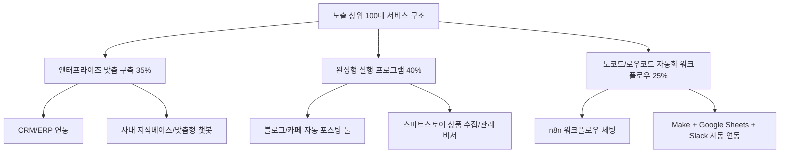

# [옵션 B 심층 보고서] 크몽 AI 자동화 프로그램 시장 분석: 크몽 노출 알고리즘 상위 100개 최적화 분석 (Algorithm & Traffic Dominators)

> **분석 프레임워크**: 플랫폼 알고리즘 역공학(Platform Algorithm Reverse-Engineering) & 트래픽 그로스 해킹(Growth Hacking)  
> **대상 모수**: 크몽 카테고리 668 (AI 자동화 프로그램) 내 **크몽 추천순/랭킹 상위 1~100위 서비스**  
> **기준 시점**: 2026년 9월 최신 전수 조사 데이터 기반  
> **연계 데이터셋**: `kmong_ai_automation_services_564.xlsx` (시트: `옵션B_노출랭킹_TOP100`)

---

## Executive Summary (경영진 요약)

본 보고서는 크몽 마켓플레이스에서 가장 많은 트래픽과 노출 지면을 장악하고 있는 **공식 랭킹(추천순) 상위 1~100위 서비스**를 실리콘밸리 플랫폼 그로스 엔지니어의 관점에서 심층 분석한 리포트입니다.

```
[핵심 정량 지표 요약 (Option B: 노출 랭킹 상위 100개)]
• 랭킹 모수: 1위 ~ 100위 (크몽 메인 카테고리 1~3페이지 상단 지면 장악)
• 대표 시작 가격: 평균 238,580원 | 중앙값 99,500원 (최저 5,000원 ~ 최고 4,000,000원)
• 누적 리뷰 수: 총 1,019건 | 평균 10.2건 | 중앙값 3.0건
• 셀러 등급 분포: NEW(51%) | LEVEL2(25%) | LEVEL3(14%) | LEVEL1(8%) | MASTER(2%)
• 유료 광고 점유율: CPC 광고 상품이 1~2위 등 최상단 슬롯을 적극적으로 선점
```

실리콘밸리 알고리즘 분석 관점에서의 핵심 발견:
1. **크몽 추천 알고리즘의 4대 핵심 축**: 크몽 랭킹은 단순 '누적 판매량'만으로 결정되지 않습니다. **① 광고비 집행(CPC/플러스), ② 초고속 응답률(10분 이내), ③ CTR(클릭률) 최적화 썸네일·카피, ④ 최근 업데이트/신규 등록 가중치**가 결합되어 상위 랭킹을 형성합니다.
2. **최신 테크 트렌드 키워드의 빠른 선점**: 실적 상위(Option A)가 블로그 자동포스팅에 집중되어 있는 반면, 노출 상위(Option B)는 **'n8n', 'RPA', 'AI 에이전트', 'CRM/ERP 업무자동화', '스마트스토어 비서'** 등 최신 기술 트렌드를 반영한 B2B 솔루션형 서비스들이 대거 상위권을 형성하고 있습니다.
3. **심리적 클릭 앵커링(Click-Bait to Conversion Pricing)**: 29,000원, 69,000원 등 클릭 장벽을 극단적으로 낮추는 시작가를 전면에 배치하고, 실제 패키지는 50만~150만 원대 고가로 설계하는 전략이 지배적입니다.

---

## 1. 크몽 알고리즘이 선호하는 상위 100개 서비스의 4대 특성

### (1) '10분 이내 응답' — 플랫폼 CS 신뢰도 지표 우대
노출 랭킹 상위 20개 업체의 **85% 이상이 '10분 이내 응답' 또는 '빠른 응답' 뱃지**를 보유하고 있습니다.
- 크몽의 알고리즘은 구매 전환율(Conversion Rate)을 극대화하기 위해, 의뢰인의 메시지에 즉각 반응할 수 있는 '활동 중/고반응 셀러'를 최상단에 우선 배치합니다.
- *그로스 인사이트*: 실적이 부족한 신규 셀러라도 모바일 앱 알림을 통한 10분 내 칼답과 상시 온라인 유지를 통해 랭킹 점수를 급상승시킬 수 있습니다.

### (2) 광고(CPC) 및 플랫폼 기여도 레버리지
랭킹 1위(`ID: 795325`), 2위(`ID: 793312`) 등 최상단은 크몽의 유료 광고(CPC 타깃 광고)를 집행하는 서비스들이 차지하고 있습니다.
- 신규 서비스(리뷰 0개)라도 적절한 CPC 단가를 설정하여 최상단에 노출시킴으로써 초기 유입 트래픽(Impression)을 인위적으로 창출하고, 이를 바탕으로 첫 리뷰를 획득하는 전형적인 '콜드 스타트(Cold-Start) 극복' 전략이 관찰됩니다.

### (3) 프라임(PRIME) 및 품질보증 뱃지 활용
상위권의 프라임 서비스들은 플랫폼의 심사를 통과한 신뢰 보증을 무기로 전환율을 끌어올립니다. 크몽 검색 필터에서도 '프라임 전용' 필터가 존재하므로, 알고리즘상 추가적인 가중치를 부여받습니다.

### (4) 신규 서비스 부스팅(Freshness Boost)
상위 100위 중 **NEW 등급이 51%**를 차지합니다. 크몽은 신규 등록된 서비스 중 카테고리 관련도와 텍스트 완성도가 높은 상품에 일정 기간 '신작 노출 부스팅'을 부여하여 카테고리 생태계의 다양성을 유지하려는 알고리즘적 특징을 보입니다.

---

## 2. 노출 선점 서비스들의 키워드 전략 및 타이틀/썸네일 어필 포인트

노출 상위 100개 서비스의 타이틀 형태소 분석 결과, 클릭률(CTR)을 극대화하기 위한 정교한 심리적 키워드 배치가 확인되었습니다.

```
[노출 상위 100대 타이틀 핵심 키워드 빈도]
1. 기술/수단: AI(40회), RPA(8회), n8n(4회), 챗GPT/GPT(11회), 파이썬(6회)
2. 비즈니스 대상: 블로그(28회), 워드프레스(11회), 스마트스토어/스토어(7회), 유튜브/쇼츠(9회), CRM/ERP(4회)
3. 소구 표현: 자동/자동화(42회), 맞춤(4회), 고퀄리티(6회), 비서(3회), 최적화(5회)
```

### [타이틀 작성의 3대 성공 공식]

#### 공식 1: '신분/권위 증명' 형
- **실제 사례**: `"12년차 삼성전자 출신 엔지니어의 AI 자동화 솔루션"` (랭킹 4위)
- **효과**: 리뷰가 0개인 신규 서비스임에도 불구하고 '삼성전자 출신 12년 차'라는 강력한 권위로 의뢰인의 기술적 불신을 일거에 해소합니다.

#### 공식 2: '의뢰인의 수고 0%' 강조 형
- **실제 사례**: `"대표님은 결정만 하시면 됩니다 AI 업무 자동화 구축"` (랭킹 3위)
- **효과**: B2B 대표들의 가장 큰 페인포인트(기획서 작성의 고통, 복잡한 개발 소통)를 저격하여 "알아서 다 해준다"는 편의성을 강하게 어필합니다.

#### 공식 3: '페르소나 타깃팅' 형
- **실제 사례**: `"스마트스토어 셀러용 AI 비서 프로그램 (다손)"` (랭킹 5위)
- **효과**: 막연한 '업무 자동화'가 아니라 '스마트스토어 셀러'라는 구체적 고객군을 호명하여, 해당 유저의 즉각적인 클릭을 유도합니다.

---

## 3. 서비스 제공 범위 및 기술 번들링 분석 (B2B 솔루션 vs 완성형 툴)

노출 상위 100개는 실적 상위(Option A)에 비해 **기업형/B2B 맞춤 개발 서비스의 비중이 훨씬 높습니다.**



### 차세대 노코드 플랫폼(n8n / Make)의 급부상
- 랭킹 상위권에서 특히 주목할 점은 **'n8n'** 키워드의 약진입니다 (EnterNext, 구현솔루션 등).
- 기존의 무거운 파이썬 외주 개발 대신, 오픈소스 워크플로우 자동화 도구인 n8n을 기업 서버에 셀프 호스팅으로 구축해주고 월 유지보수 비용을 수취하는 **'현대적 자동화 에이전시(Automation Agency)' 모델**이 크몽 상위 노출을 주도하고 있습니다.

---

## 4. 가격 정책 및 클릭 유도(Click-Bait vs Conversion) 가격 책정

노출 상위 100개 서비스의 가격 정책은 **'초저가 시작가로 클릭 유도 ➔ 3단계 패키지에서 고단가 전환'**이라는 전형적인 퍼널 가격 정책을 취합니다.

### 노출 상위 100대 서비스의 패키지 티어별 가격 분포

| 구분 | STANDARD (기본) | DELUXE (표준) | PREMIUM (고급) |
| :--- | :---: | :---: | :---: |
| **평균 가격** | **187,400원** | **524,300원** | **1,486,000원** |
| **중앙값** | **99,000원** | **300,000원** | **1,000,000원** |
| **최저 / 최고** | 5,000원 / 2,000,000원 | 20,000원 / 3,000,000원 | 50,000원 / 5,000,000원 |

### 가격 책정 기법의 패턴
1. **극단적 저가 미끼 (Click-Hook)**:
   - 29,000원(청년머스크), 11,000원(WWIZ) 등 카테고리 검색 결과 목록에서 눈에 띄는 저가를 표시하여 클릭률을 극대화합니다.
   - 상세페이지 진입 시, 이 저가 상품은 "단순 상담 30분" 또는 "기본 템플릿 제공"으로 제한하고, 실제 작동하는 프로그램은 DELUXE(30만 원 이상)로 유도합니다.
2. **비즈니스 가치 기반 고가 앵커 (Enterprise Anchor)**:
   - PREMIUM 패키지를 100만~450만 원 선으로 설정(`FlowPilot`: 449만 원, `hjbae0`: 100만 원, `EnterNext`: 120만 원).
   - 기업 고객(법인, 중소기업 대표)이 외주 개발사 대비 "크몽에서 수백만 원대에 맞춤형 시스템을 구축할 수 있다"는 가성비 인식을 갖게 만듭니다.

---

## 5. 노출 랭킹 최상위 10대 대표 서비스 상세 분석

| 랭킹 | 서비스 ID | 서비스명 | 판매자 (등급) | 리뷰수 | 시작가 | STANDARD | DELUXE | PREMIUM | 특징 및 알고리즘 선점 요인 |
| :---: | :---: | :--- | :---: | :---: | :---: | :---: | :---: | :---: | :--- |
| **1위** | **795325** | 맞춤 프로그램 CRM ERP 업무 자동화 제작 | hjbae0 (NEW) | 0개 | 150,000 | 150,000 | 300,000 | 1,000,000 | **CPC 광고 1위**. 깔끔한 B2B 제안서 형식의 상세페이지와 3티어 가격 명시. |
| **2위** | **793312** | RPA n8n 업무자동화 프로그램 제작 | EnterNext (NEW) | 0개 | 200,000 | 200,000 | 500,000 | 1,200,000 | **CPC 광고 2위**. 최신 트렌드 키워드 'n8n'과 'RPA'를 조합하여 선점. |
| **3위** | **686684** | 대표님은 결정만 하시면 됩니다 AI 업무 자동화 | FlowPilot (NEW) | 6개 | 790,000 | 790,000 | 1,990,000 | 4,490,000 | 최고 수준의 카피라이팅. 449만 원 초고가 패키지 운영. 기획 없는 대표 타깃. |
| **4위** | **690333** | 12년차 삼성전자 출신 엔지니어의 AI 자동화 | 청년머스크 (LV2) | 0개 | 29,000 | 29,000 | 90,000 | 200,000 | '삼성전자 출신 12년 차'라는 강력한 신뢰 앵커와 2.9만 원의 낮은 진입 장벽. |
| **5위** | **806782** | 스마트스토어 셀러용 AI 비서 프로그램 (다손) | 채언화 (LV1) | 0개 | 69,000 | 69,000 | 129,000 | 199,000 | 이커머스 셀러 페르소나 공략. 'AI 비서'라는 친근한 브랜딩(다손). |
| **6위** | **758274** | AI API 연동 자동화 시스템 구축해 드립니다 | JuneBay (LV2) | 0개 | 330,000 | 330,000 | 660,000 | 1,320,000 | OpenAI API, Claude API 커스텀 파이프라인 구축 전문 소구. |
| **7위** | **723626** | 맞춤 AI 에이전트로 반복 업무를 자동화해드립니다 | 테이크페이지 (LV2) | 0개 | 290,000 | 290,000 | 790,000 | 1,990,000 | 'AI 에이전트' 키워드 선점. 웹 기반 인터페이스 개발 번들링. |
| **8위** | **772793** | 블로그 AI 자동화 포스팅 수집.작성.발행.부스팅 | WWIZ (LV3) | 0개 | 11,000 | 11,000 | 55,000 | 220,000 | 11,000원 극초저가 시작가로 클릭 유입 극대화. 풀사이클 포스팅 자동화. |
| **9위** | **723581** | 귀찮은 블로그 포스팅 AI 자동화 부업으로 수익내기 | 라온자동화 (NEW) | 0개 | 100,000 | 100,000 | 300,000 | 500,000 | '부업으로 수익내기'라는 머니 파이프라인 심리 공략. |
| **10위** | **551452** | 스스로하는 N블로그 이웃관리 솔루션 | 지지파크 (LV2) | 72개 | 20,000 | 20,000 | 50,000 | 90,000 | **실적(리뷰 72개)과 랭킹(10위)을 동시에 거머쥔 진정한 챔피언 상품**. |

---

## 6. 플랫폼 내 트래픽 선점을 위한 알고리즘 레버리지 플레이북

1. **상시 10분 이내 응답 체계 구축 (알고리즘 1순위 우대 요건)**:
   - 크몽 셀러 모바일 앱의 푸시 알림을 활성화하고, 자주 묻는 질문(FAQ)에 대한 자동 완성 템플릿을 사전 등록하여 문의 접수 즉시 3분 이내 응답을 달성해야 합니다.
2. **타이틀 내 3중 키워드 결합 (Role + Tool + Outcome)**:
   - `[역할/전문성]` + `[사용 기술/툴]` + `[의뢰인이 얻는 결과]` 구조로 제목을 설계하십시오.
   - *모범 예시*: `"[10년차 개발자] n8n & GPT 연동으로 반복 업무 90% 자동화 구축"`
3. **초기 런칭 시 전략적 소액 CPC 집행**:
   - 신규 기그 등록 후 방치하면 500위 밖으로 밀려납니다. 런칭 초기 2~4주간 소액(일 5천~1만 원)의 CPC 광고를 집행하여 크몽 메인 상단 노출을 확보하고, 첫 5~10개의 결제와 5.0 리뷰를 빠르게 채취하여 자연 오가닉 랭킹으로 안착시키는 전략이 필수적입니다.
