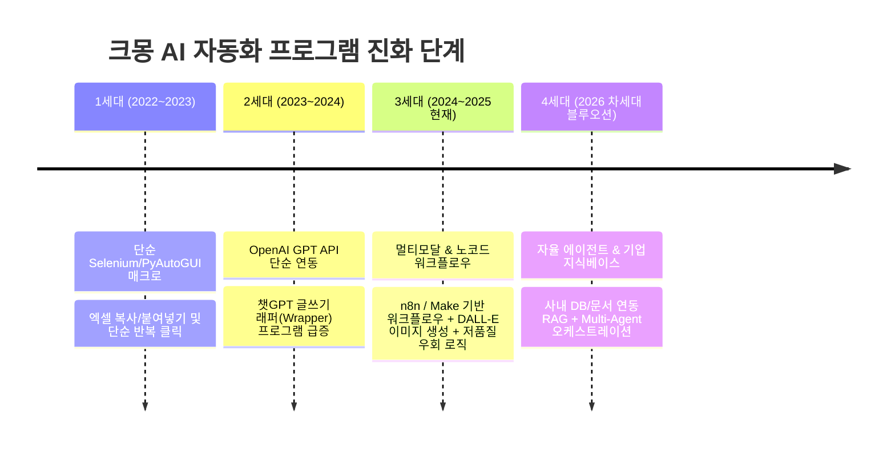

# [옵션 C 심층 보고서] 크몽 AI 자동화 프로그램 시장 종합 전략: 랭킹 선점형(50) vs 실적 검증형(50) 비교 및 융합 전략 (Hybrid Synthesis)

> **분석 프레임워크**: 실리콘밸리 탑티어 전략 컨설팅(McKinsey / Bain) & $100M Offers(Alex Hormozi) 프레임워크  
> **대상 모수**: 크몽 카테고리 668 (AI 자동화 프로그램) 내 **노출 랭킹 상위 50개 + 실적(누적 리뷰) 상위 50개 융합 데이터셋 (총 100개)**  
> **기준 시점**: 2026년 9월 최신 전수 조사 데이터 기반  
> **연계 데이터셋**: `kmong_ai_automation_services_564.xlsx` (시트: `옵션C_하이브리드_TOP100`)

---

## Executive Summary (경영진 요약)

본 보고서는 **'알고리즘과 트래픽을 선점한 랭킹 상위 그룹(Top 50)'**과 **'실제 고객 결제와 리뷰로 검증된 실적 상위 그룹(Top 50)'**을 교차 분석하여, 크몽 AI 자동화 시장의 양대 축을 한눈에 조망하고 이를 융합한 **최강의 시장 진입 및 1위 정복 전략(Go-To-Market Strategy)**을 제시합니다.

```
[하이브리드 100대 서비스 핵심 지표 요약]
• 총 리뷰 수: 1,126건 | 평균 평점: 4.93점
• 대표 시작가: 평균 278,520원 | 중앙값 100,000원 (스펙트럼: 5,000원 ~ 4,000,000원)
• 셀러 등급 분포: NEW(53%) | LEVEL2(21%) | LEVEL3(16%) | LEVEL1(7%) | MASTER(3%)
• 교집합(트래픽과 실적을 모두 장악한 상위 5대 챔피언): 지지파크, HelloBDD, 플머개구리, 리부티너, PRZME
```

### 핵심 전략적 시사점
1. **두 그룹의 뚜렷한 이원화**: 
   - **랭킹 선점 그룹(Top 50)**: 'n8n', 'RPA', '맞춤형 ERP/CRM', 'AI 에이전트' 등 **B2B 기업형 솔루션** 위주. 비전은 크나 아직 초기 실적 축적 단계.
   - **실적 검증 그룹(Top 50)**: '네이버 블로그', '워드프레스 애드센스', '카페 바이럴', '이웃 소통' 등 **DTC 개인/소상공인 트래픽 자동화** 위주. 즉각적인 현금 흐름 창출.
2. **승자의 융합 공식 (The Hybrid Winner)**:
   - 플랫폼에서 가장 성공한 최상위 셀러들은 **"실적 그룹의 즉각적 현금 창출력(Cash Flow) & 빠른 리뷰 획득력"**과 **"랭킹 그룹의 세련된 B2B 브랜딩 & 고단가 패키징(Enterprise Positioning)"**을 절묘하게 결합하고 있습니다.

---

## 1. 랭킹 선점 그룹(Top 50) vs 실적 검증 그룹(Top 50) 비교 대조

| 비교 항목 | 랭킹 선점 그룹 (Algorithm Dominators) | 실적 검증 그룹 (Proven Cash Cows) | 융합형 챔피언 (Hybrid Winners) |
| :--- | :--- | :--- | :--- |
| **주력 제품군** | 사내 업무 자동화, n8n, CRM/ERP 맞춤 개발 | 블로그/카페 자동포스팅, 이웃소통 툴 | 완성형 툴 + 맞춤 커스텀 엔터프라이즈 |
| **타깃 고객 (ICP)** | 중소기업 대표, 스타트업 기획자 | 1인 사업자, 제휴마케터, 부업 희망자 | 소상공인부터 에이전시/기업 마케팅팀까지 |
| **메시징 톤앤매너** | "12년차 삼성 출신", "기획 없이 맡기세요" | "저품질 0%", "하루 5분 포스팅으로 수익화" | "검증된 알고리즘 안전성 + 기업 맞춤 연동" |
| **평균 시작가** | 200,000 ~ 790,000원 (상대적 고가) | 20,000 ~ 150,000원 (진입장벽 최소화) | 29,000원(엔트리) ~ 1,500,000원(풀패키지) |
| **핵심 성공 레버** | CPC 광고, 10분 내 칼답, 트렌드 키워드 | 강력한 Social Proof(리뷰 50+), 구전 효과 | 초반 CPC로 리뷰 획득 ➔ 오가닉 전환 |

---

## 2. 크몽 AI 자동화 시장의 4세대 진화 모델 (Technology Roadmap)

크몽 내 563개 서비스의 기술 스택을 추적한 결과, 국내 AI 자동화 시장은 급격한 세대교체를 겪고 있습니다.



### [현재 시장의 병목과 기회 요인 (Market Gap)]
- **레드오션(극심한 경쟁)**: "단순 챗GPT API를 붙여 네이버 블로그 글을 써주는 프로그램"은 이미 수십 개가 난립하며 가격 파괴(1~2만 원대)가 진행 중입니다.
- **블루오션(공급 부족 고마진 영역)**:
  1. **멀티모달 숏폼 생성 파이프라인**: 대본(GPT) ➔ 음성(ElevenLabs/Typecast) ➔ 영상 컷 편집(FFmpeg/CapCut) ➔ 유튜브 쇼츠/릴스 자동 업로드
  2. **기업 사내 데이터 연동(RAG) 비서**: 슬랙/노션/구글드라이브의 사내 문서를 학습하여 CS 및 견적서를 자동 작성하는 전용 에이전트
  3. **n8n 셀프호스팅 구축 및 유지보수**: 기업의 API 비용과 서버 유지비를 최적화해 주는 B2B 리테이너 서비스

---

## 3. 실리콘밸리식 고수익 킬러 오퍼(Killer Offer) 설계 청사진

실리콘밸리의 전설적인 오퍼 공식인 **Alex Hormozi의 Value Equation**을 적용하여, 크몽 구매자가 거절할 수 없는 압도적 오퍼를 구조화합니다.

$$\text{Value} = \frac{\text{Dream Outcome (꿈의 결과)} \times \text{Perceived Likelihood (성공 확률)}}{\text{Time Delay (소요 시간)} \times \text{Effort \& Sacrifice (노력과 희생)}}$$

```
[Value Equation을 적용한 킬러 오퍼 구조]
1. Dream Outcome (결과 극대화):
   "월 250만 원 상당의 전문 마케터가 24시간 쉬지 않고 일하는 시스템 구축"
2. Perceived Likelihood (성공 확률 극대화):
   "네이버 상위 1위 실제 발행 글 50개 링크 공개 + 100% 미작동 시 전액 환불 보증"
3. Time Delay (시간 지연 최소화):
   "구매 후 2시간 이내 원격 설치 완료, 오늘 밤부터 바로 자동 발행 시작"
4. Effort & Sacrifice (노력 최소화):
   "코딩? 기획? 필요 없습니다. 키워드 1개만 입력하면 제목/본문/이미지/태그까지 전자동"
```

### 추천 3티어 패키징 설계안

```
[STANDARD] 스타터 (체험 및 리뷰 획득용) — 49,000원
• 대상: 1인 사업자, 1개 계정 운영
• 기능: 하루 3개 포스팅 or 이웃소통 50건 자동화 (1개월 라이선스)
• 혜택: 원격 1:1 세팅 무료 지원 + 사용 가이드북 PDF

[DELUXE] 비즈니스 프로 (가장 추천하는 베스트셀러) — 390,000원
• 대상: 마케팅 대행사, 블로그 3~5계정 운영자
• 기능: 무제한 포스팅, DALL-E 썸네일 자동 제작, 휴먼 타이핑 모션(저품질 방지), 1년 라이선스
• 혜택: 알고리즘 업데이트 시 1년간 무상 패치 지원 + 전용 단톡방 초대

[PREMIUM] 엔터프라이즈 맞춤 구축 (고수익 모델) — 1,490,000원
• 대상: 중소기업, 전문 이커머스 쇼핑몰, B2B 법인
• 기능: 사내 DB(CRM/ERP) 연동, n8n 전용 서버 구축, 완전 독점 소스코드 납품
• 혜택: 3개월 무상 유지보수 + 담당 엔지니어 직통 핫라인 제공
```

---

## 4. 하이브리드 상위 대표 15개 서비스 포트폴리오 맵

| 순번 | 서비스 ID | 서비스명 | 셀러 (등급) | 리뷰수 | 시작가 | 카테고리/특징 | 포지셔닝 유형 |
| :---: | :---: | :--- | :---: | :---: | :---: | :--- | :--- |
| **1** | **795325** | 맞춤 프로그램 CRM ERP 업무 자동화 제작 | hjbae0 (NEW) | 0개 | 150,000 | B2B 맞춤 ERP/CRM | 랭킹 선점형 |
| **2** | **793312** | RPA n8n 업무자동화 프로그램 제작 | EnterNext (NEW) | 0개 | 200,000 | 노코드 n8n RPA | 랭킹 선점형 |
| **3** | **686684** | 대표님은 결정만 하시면 됩니다 AI 업무 자동화 | FlowPilot (NEW) | 6개 | 790,000 | B2B 턴키 자동화 | 고단가 선점형 |
| **4** | **690333** | 12년차 삼성전자 출신 엔지니어의 AI 자동화 | 청년머스크 (LV2) | 0개 | 29,000 | 대기업 출신 엔지니어링 | 신뢰 앵커형 |
| **5** | **806782** | 스마트스토어 셀러용 AI 비서 프로그램 | 채언화 (LV1) | 0개 | 69,000 | 이커머스 맞춤 비서 | 페르소나형 |
| **6** | **551452** | 스스로하는 N블로그 이웃관리 솔루션 | 지지파크 (LV2) | **72개** | 20,000 | 블로그 트래픽/이웃소통 | **융합 챔피언** |
| **7** | **494553** | 티스토리 자동포스팅 고퀄리티 프리미엄 | 플머개구리 (LV3) | **79개** | 349,000 | 애드센스 티스토리 자동화 | **실적 챔피언** |
| **8** | **609525** | Make AI 자동화 | 리부티너 (NEW) | **70개** | 200,000 | Make 비즈니스 연동 | **융합 챔피언** |
| **9** | **577310** | 프리즘 올인원 블로그 마케팅 플랫폼 | PRZME (NEW) | **68개** | 122,000 | 올인원 SaaS 플랫폼 | **융합 챔피언** |
| **10** | **602712** | 유사/중복/누락 전혀 없는 블로그 자동 글쓰기 | Virallab (MASTER) | **57개** | 1,320,000 | B2B 고가 마케팅 솔루션 | **하이엔드 챔피언** |
| **11** | **619128** | 블로그 활성화/이웃관리/소통/좋아요 AI 솔루션 | HelloBDD (LV3) | **53개** | 29,000 | 블로그 감성 소통 툴 | **실적 우수** |
| **12** | **607823** | AI연동 지능형 블로그 관리대행 통합솔루션 | 진주팩토리 (LV2) | **51개** | 27,000 | 관리대행 통합 자동화 | **실적 우수** |
| **13** | **638906** | 워드프레스 티스토리 고퀄리티 최적화 자동포스팅 | AI자동화공장장 (NEW) | **44개** | 990,000 | 워드프레스 애드센스 공장 | **고단가 챔피언** |
| **14** | **592971** | N사 카페 소통/가입인사 완전 자동화 AI 매니저 | HelloBDD (LV3) | **42개** | 29,000 | 카페 침투 바이럴 자동화 | **틈새 챔피언** |
| **15** | **628044** | 고퀄리티 워드프레스 AI 자동포스팅 프로그램 | 위드인컴 (NEW) | **38개** | 139,000 | SEO 메타데이터 자동 주입 | **실적 우수** |

---

## 5. 90일 마스터플랜: 크몽 AI 자동화 카테고리 1위 정복 로드맵

신규 진입자 또는 기존 판매자가 크몽 AI 자동화 카테고리에서 최단기간 내 압도적 1위로 올라서기 위한 3단계 90일 실행 매뉴얼입니다.

```
[90-Day Execution Roadmap]

[Phase 1: 1~30일] 마찰 제로 런칭 & 첫 20개 5.0 리뷰 확보 (Cold Start 극복)
  1. 기그 등록: '29,000원' 엔트리 상품 등록 (기본 블로그/SNS 소통 자동화 or n8n 기본 템플릿 세팅)
  2. 타이틀 최적화: [권위(경력)] + [대상(블로그/스토어)] + [결과(자동화)] 조합
  3. 초도 트래픽 부스팅: 일 1만 원 내외 소액 CPC 광고 집행으로 카테고리 1페이지 상단 노출
  4. 광속 CS: 크몽 앱 알림 상시 ON, 3분 이내 응답 체계 유지
  5. 감동 서비스: 원격 1:1 설치 지원 + 구매자에게 보너스 프롬프트집 증정 ➔ 5.0 리뷰 100% 회수

[Phase 2: 31~60일] 패키지 리밸런싱 & 고단가(High-Ticket) 라인업 확장
  1. 리뷰 20개 축적 즉시, DELUXE(39만 원), PREMIUM(99만~149만 원) 패키지 전면 개편
  2. 기술 차별화 탑재: 단순 텍스트 생성을 넘어 "이미지 자동생성 + 휴먼 마우스 모션 + 프록시 우회" 번들링
  3. 상세페이지 V2 업그레이드: 실제 구동 GIF 3개 + 고객 성공 사례(방문자/수익 그래프) 추가
  4. 멀티 기그(Multi-Gig) 런칭: 블로그용 1개, 카페용 1개, n8n B2B용 1개 등 3개 포트폴리오로 교차 유입 유도

[Phase 3: 61~90일] B2B 리테이너(Retainer) 확보 및 카테고리 오가닉 1위 안착
  1. 1회성 소프트웨어 판매를 넘어 "월 15만~30만 원 유지보수 및 서버 관리" 구독형 오퍼 제안
  2. 크몽 프라임(PRIME) 신청 및 뱃지 획득
  3. 오가닉 랭킹 Top 5 고착화: 누적 리뷰 50개 돌파로 광고비 없이도 자연 유입되는 무한 선순환 엔진 완성
```

---

## 6. 결론: 실리콘밸리 파트너의 최종 제언

크몽의 'AI 자동화 프로그램' 카테고리는 현재 **전체 563개 서비스 중 19%(109개)만이 실제 매출을 내고 있는 전형적인 초기 성장 시장(Early-Growth Stage)**입니다.

- 기술적 진입 장벽은 오픈소스 라이브러리와 LLM API로 인해 급격히 낮아졌습니다.
- 승패를 가르는 것은 **코딩 실력이 아니라 '고객의 공포(계정 저품질)를 없애주는 세심한 UX'와 '즉각적인 돈과 시간을 벌어다 주는 직관적 패키징'**입니다.
- 본 보고서와 함께 제공된 `kmong_ai_automation_services_564.xlsx`의 563개 전수 데이터 및 3종 분석 MD 파일을 나침반 삼아, 압도적인 시장 점유율을 선점하시기 바랍니다.
