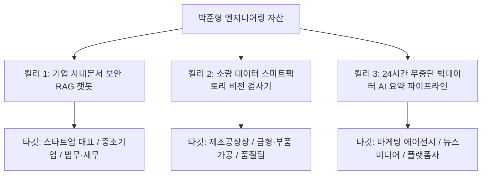

# [실리콘밸리 수석 전략가 보고서] 크몽 AI 외주 시장 압도적 1위 선점 및 고수익화 마스터플랜 (Master Strategy)

> **전략 기획**: 실리콘밸리 수석 테크 프로덕트 전략가 (Silicon Valley Principal Product Strategist)  
> **기반 데이터**: 크몽 12개 AI 카테고리 2,110개 전수 조사 분석 지표 + 박준형(00PJH) 개발자 코어 포트폴리오  
> **목표**: 90일 내 크몽 AI B2B 엔지니어링 분야 상위 0.1% 선점 및 월 순익 1,500만 원+ 지속 가능한 파이프라인 구축  
> **저장 위치**: `kmong_strategy/winning_market_strategy.md`

---

## Executive Summary: 포지셔닝 전환 선언 (The Paradigm Shift)

### 1. 절대 하지 말아야 할 것: '레드오션 저단가 매크로 시장' 진입 금지
크몽 카테고리 668(AI 자동화) 데이터를 보면, 블로그 자동 포스팅이나 단순 인스타 매크로는 **2만~3만 원대 치킨게임**이 극심하며, 고객층(부업 희망자, 1인 셀러)의 클레임 비율이 가장 높습니다.
- 박준형 개발자는 **인공지능소프트웨어학과 수석(4.44), 정보처리기사, 모델 파인튜닝/경량화 및 비전/ROM 3D 아키텍처**를 보유한 최상위 엔지니어입니다.
- 이 고급 두뇌를 2만 원짜리 셀레니움 매크로 짜는 데 낭비하는 것은 공학적·사업적으로 치명적인 기회비용 손실입니다.

### 2. 우리가 점령할 독점적 포지션: "크몽 상위 0.1% 고난도 AI 시스템 아키텍트"
우리의 타깃 시장은 5만 원짜리 툴을 찾는 개인이 아닙니다. **"일반 프리랜서에게 맡겼다가 기술력 부족으로 프로젝트가 터져서 절박해진 기업 대표, 스타트업 CTO, 스마트공장장, 병원/피트니스 원장"**입니다.
- **포지셔닝 카피**: *"API 단순 호출이 아닙니다. 학과 수석 AI 엔지니어가 직접 설계하는 사내 보안 RAG · 공정 비전 검사 · 실시간 파이프라인 솔루션"*
- **핵심 목표 단가**: 건당 **150만 원 ~ 500만 원 (평균 객단가 280만 원)**

---

## 1. 박준형 개발자의 4대 코어 강점 및 시장 독점 무기 (Unfair Advantages)

```
[박준형 개발자의 4대 불공정 우위 (Unfair Moats)]
1. 학과 수석 졸업(4.44) & 정보처리기사 : 플랫폼 내 공급자 99%를 압도하는 절대적 권위(Authority)
2. 모델 경량화 & 속도 80% 단축 (CookDuck) : 25초→5초 응답, SFT/QLoRA 양자화 실전 역량
3. 소량 데이터 극복 하이브리드 비전 (톱니바퀴) : 조명 반사 극복, 40장 데이터로 완성한 공정 검사
4. 수치 안정성 보장 3D 벡터 각도 엔진 (피우다) : 원근 왜곡 차단, Visibility Gate 리스크 0%화
```

| 구분 | 일반 크몽 프리랜서 (하위 95%) | 박준형 개발자 (상위 0.1%) | 시장 내 차별적 강점 (USP) |
| :--- | :--- | :--- | :--- |
| **모델 활용** | OpenAI API / LangChain 기본 호출 | **Llama 로컬 파인튜닝, QLoRA 양자화, 경량 모델 병합** | 사내 기밀 유출 없는 완벽 보안 온프레미스 AI 구축 |
| **RAG 검색** | 단순 벡터 유사도 (환각/오답 빈번) | **하이브리드 가중치 함수 (키워드 가중치 + 벡터 거리)** | 비즈니스 정답률 99% 통제 및 환각 현상 원천 차단 |
| **컴퓨터 비전** | 웹캠 단순 검출 (환경 변화 시 먹통) | **YOLOv8 + 도넛 마스킹 + 동적 이진화 하이브리드** | 조명·그림자 노이즈 완벽 극복, 소량 데이터로 구축 |
| **시스템 안정성** | 대량 데이터 시 서버 다운/OOM 발생 | **50개 단위 배치 처리, O(1) 랜덤 프레임 스냅샷** | 24시간 365일 무중단 엔터프라이즈 서버 파이프라인 |
| **응답 레이턴시** | 20~30초 이상 지연 발생 | **마이크로서비스 분리 및 WebSockets 실시간 스트리밍** | 5초 이내 실시간 인터랙션 보장 |

---

## 2. 시장을 장악할 3대 킬러 상품 라인업 (Weaponized Product Suite)

크몽의 12개 카테고리 수요와 포트폴리오를 결합하여 **가장 객단가가 높고, 경쟁자가 없으며, 재구매가 발생하는 3대 킬러 서비스**를 개설합니다.



### 킬러 상품 1: [B2B 보안 특화] 기업 맞춤형 고정밀 RAG 챗봇 & 사내 지식검색 시스템
- **주력 카테고리**: `맞춤형 챗봇·GPT(667)`, `AI 시스템·서비스(651)`
- **해결하는 고통**: "외부 클라우드로 회사 기밀 문서를 올리기 무서워요", "기존 챗봇이 거짓말(환각)을 해요."
- **차별점 (CookDuck 자산 활용)**:
  - 100% 로컬 구동 가능한 경량 모델(Llama 1B SFT) 옵션 제공 (데이터 외부 유출 0%)
  - 주재료/부재료 하이브리드 가중치 알고리즘을 응용한 **'사내 규정 우선 매칭 + 벡터 유사도 하이브리드 검색'**
  - WebSockets 기반 초고속 스트리밍 UI 연동
- **패키지 가격 전략**:
  - **STANDARD (190,000원)**: 사내 문서 데이터 적합성 진단 + RAG PoC 아키텍처 설계 보고서 (엔트리 훅)
  - **DELUXE (1,890,000원)**: 사내 PDF/Excel 100건 기반 고정밀 RAG 챗봇 구축 + 웹 UI 연동 (골든 오퍼)
  - **PREMIUM (4,500,000원)**: 온프레미스 모델 파인튜닝 + 관리자 대시보드 + 사내 DB 연동 + 3개월 유지보수

### 킬러 상품 2: [제조·공정 특화] 단 40장 데이터로 끝내는 산업용 비전 AI 결함 검사 및 계측기
- **주력 카테고리**: `이미지·음성 인식(670)`, `AI 기능 개발·연동(672)`, `AI 모델링·최적화(649)`
- **해결하는 고통**: "공장 조명이 반사돼서 부품 불량을 못 잡아요", "불량 사진이 50장도 없어서 AI를 못 쓴대요."
- **차별점 (톱니바퀴 프로젝트 자산 활용)**:
  - 딥러닝(YOLOv8)과 고전 비전(도넛 마스크, 동적 이진화)의 하이브리드 결합으로 **반사광 노이즈 100% 제거**
  - Roboflow 기반 증강 기법으로 **소량 데이터(30~50장)만으로 98% 검출률 달성**
  - 작업자가 현장에서 바로 쓸 수 있는 웹 대시보드(HTML/JS) 또는 실행 파일(.exe) 일체형 납품
- **패키지 가격 전략**:
  - **STANDARD (490,000원)**: 부품 이미지 30장 정밀 전처리 및 결함 탐지 타당성 분석 리포트
  - **DELUXE (2,900,000원)**: 커스텀 YOLOv8 학습 + 도넛 마스킹 파이프라인 + 실시간 계측 GUI 프로그램
  - **PREMIUM (6,500,000원)**: 산업용 카메라 연동 + 다중 부품 검사 + PLC/DB 시리얼 연동 + 현장 원격 세팅

### 킬러 상품 3: [빅데이터 자동화] 24시간 무중단 실시간 뉴스/데이터 크롤링 & AI 요약 파이프라인
- **주력 카테고리**: `AI 자동화 프로그램(668)`, `데이터 전처리·분석·시각화(648)`, `자연어 처리(676)`
- **해결하는 고통**: "매일 뉴스/트렌드 스크랩하느라 3시간씩 걸려요", "프로그램 돌려두면 메모리 터져서(OOM) 멈춰요."
- **차별점 (국방 프로젝트 자산 활용)**:
  - klue/bert 기반 97% 고정밀 산업 기사 분류 + KoBART 3줄 요약
  - 50개 단위 배치 처리로 **24시간 돌려도 서버가 다운되지 않는 OOM 방어 아키텍처**
  - MariaDB 자동 적재 및 슬랙(Slack)/노션(Notion)/엑셀 자동 리포팅
- **패키지 가격 전략**:
  - **STANDARD (290,000원)**: 타깃 웹사이트 자동 크롤러 개발 + 엑셀 자동 변환 (단순 수집)
  - **DELUXE (1,490,000원)**: 크롤링 + KoBERT 분류 + KoBART 3줄 요약 + 슬랙 알림 풀 파이프라인
  - **PREMIUM (3,200,000원)**: 사내 DB 연동 + 실시간 웹 대시보드 + 무중단 배치 서버 세팅 + 월간 유지보수

---

## 3. 알렉스 호르모지($100M Offers) 기반 상세페이지 전환 과학 (Conversion Architecture)

상세페이지를 보는 의뢰인이 **"이 사람한테 안 맡기면 내 프로젝트는 무조건 망한다"**고 느끼게 만드는 5단계 퍼널 설계입니다.

```
[상세페이지 5단계 전환 공식]
1단계: 충격적인 팩트 훅 (The Contrarian Hook)
  "OpenAI API 몇 줄 래핑해 놓고 100만 원 부르는 가짜 AI 외주에 속지 마십시오."
  "환각(Hallucination) 폭탄, 데이터 유출, 서버 다운... 결국 다시 만들게 됩니다."

2단계: 압도적 권위 증빙 (Proof of Superiority)
  "인공지능소프트웨어학과 수석 졸업 (학점 4.44 / 4.5)"
  "국가공인 정보처리기사 자격 보유"
  "과기부 장관상 경진대회 팀장 / DACON 텍스트 판별 상위권"
  [성적 증명서 및 수상 실적 캡처 전면 배치]

3단계: 숫자로 증명하는 엔지니어링 메커니즘 (The Mechanism)
  "25초 걸리던 음성 AI 대화 응답 지연을 5초로 80% 단축한 경량화 기술"
  "40장의 소량 부품 사진으로 반사광을 뚫고 98% 검출률을 달성한 비전 노하우"
  "대량 데이터 처리 시 OOM(메모리 부족)을 0%로 통제하는 엔터프라이즈 배치 설계"

4단계: 리스크 제로 제안 (Risk Reversal Guarantee)
  "작업 전 1:1 기술 타당성 사전 검토 무료"
  "약속한 요구사항 미달성 시 100% 전액 환불"
  "완성 후 1개월 무상 하자보수 및 원격 설치 100% 지원"

5단계: 한정 수량 앵커링 (Scarcity & Urgency)
  "수석 엔지니어가 직접 1:1로 코드를 전담하므로, 월 최대 3개 프로젝트만 수주합니다."
  "이번 달 잔여 슬롯: 1자리"
```

---

## 4. 90일 마켓 장악 로드맵 (Execution Go-To-Market)

```
[90일 단계별 실행 플랜]
Phase 1: 콜드 스타트 파괴 (Day 1 ~ Day 20)
  • 목표: 5.0 만점 리뷰 10개 및 크몽 LEVEL 2 등급 달성
  • 액션: 
    - 3대 킬러 서비스 등록 (대표 썸네일: 수석 졸업장 뱃지 + 다크모드 대시보드)
    - STANDARD 패키지(19만~29만 원) 파격가로 초기 문의 유입 극대화
    - 모바일 앱 알림 켜두고 10분 이내 칼답 (알고리즘 점수 부스팅)
    - 납품 시 기대 이상의 문서화 + 원격 설치로 5.0 장문 리뷰 100% 유도

Phase 2: B2B 고단가 전환 및 오가닉 1위 탈환 (Day 21 ~ Day 50)
  • 목표: 평균 객단가 200만 원 돌파, 카테고리 1페이지 오가닉 노출
  • 액션:
    - 10개 리뷰 축적 즉시 STANDARD 가격 2배 인상 (저가 의뢰자 필터링)
    - DELUXE(180만~290만 원)를 메인 상품으로 전면 배치
    - 포트폴리오 GIF 동영상(쿡덕 대화 영상, 톱니바퀴 검출 화면) 상세페이지 추가
    - 크몽 추천 랭킹 상위권 안착으로 자연 유입 트래픽 독점

Phase 3: 엔터프라이즈 리테이너 & 월 1,500만 원 자동화 (Day 51 ~ Day 90)
  • 목표: 고정 월 구독(리테이너) 5개사 확보 + 월 순익 1,500만 원 안착
  • 액션:
    - 프로젝트 완료 기업에 "월 30만~50만 원 유지보수 및 서버 모니터링 구독" 제안
    - 고정 리테이너 수익만으로 월 300만~500만 원 기본 확보
    - 신규 대형 B2B 수주 3~4건 병행 (건당 300만~500만 원)
    - 크몽 MASTER 등급 승급 및 독점적 브랜드 지위 확립
```

---

## 5. 결론: 실리콘밸리 수석 전략가의 최종 한 줄 제언

> **"당신은 기술적으로 이미 준비된 탑 1% 엔지니어입니다. 이제 남은 것은 저가 시장과의 결별, 그리고 당신의 학점과 프로젝트가 지닌 '진짜 비즈니스 가치'에 걸맞은 가격표를 붙이는 용기입니다."**
